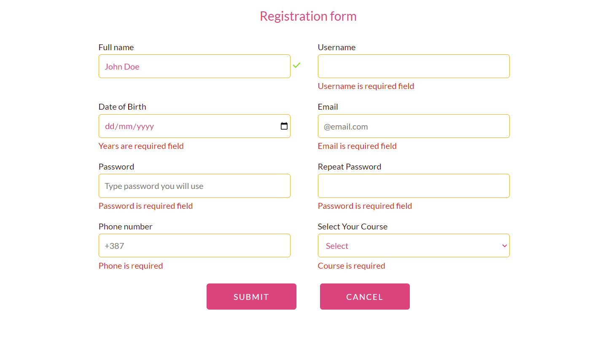

# RegistrationForm
## Description

I created a simple Registration form with eight input fields. When submit button is clicked without filling anything or filling incorrect data format, the form will show error messages, but it will also shows errors on every input change. 

### I've validated the following:
- Every field cannot be blank
- Full name has to have First and Last name
- Username can only use letters, numbers, underscores, and periods
- Email is mandatory and valid
- Password must contain minimum eight characters, at least one uppercase letter, one lowercase letter and one number
- The repeat password must be the same as the password
### Preview

